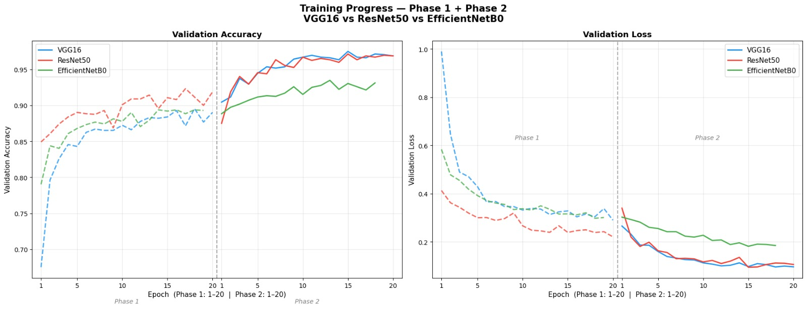
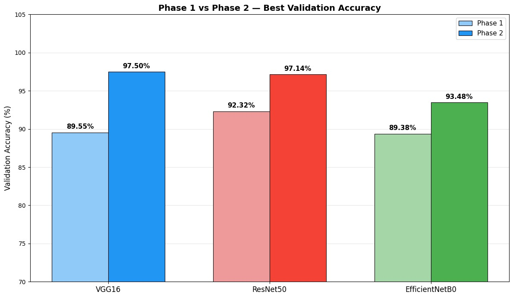
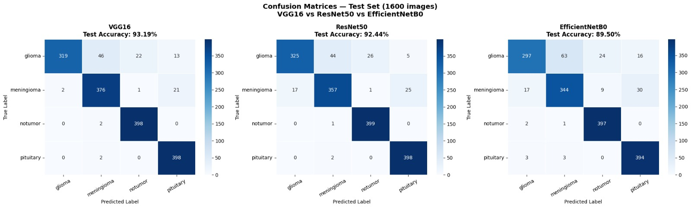
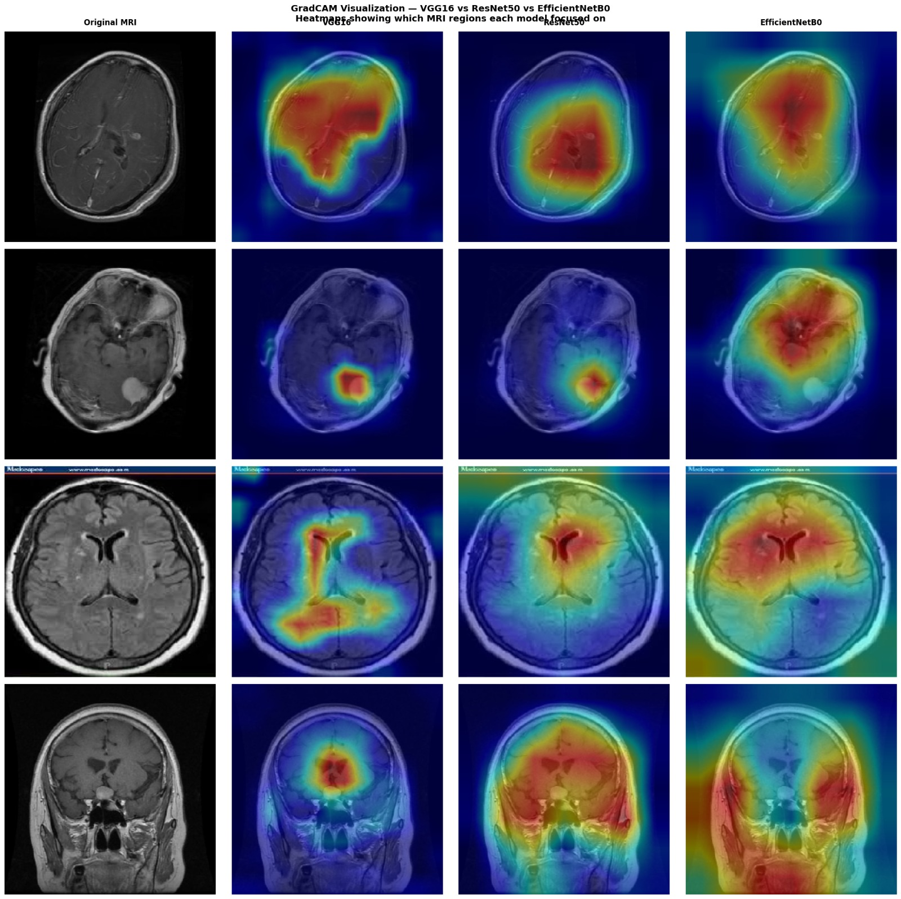

# 🧠 Brain Tumor MRI Classification
### A Deep Learning Comparative Study — VGG16 vs ResNet50 vs EfficientNetB0


> Mini Project — B.Tech AIML | Assam Don Bosco University | Batch 2024–2028  
> **Author:** Amrit Rajkumar | DC2024BTE0184  
> **Supervisor:** Dr. Nilakshi Devi

---

## 📌 Project Overview

This project implements and compares three pretrained CNN architectures for automated brain tumor classification from MRI images. The models are trained using a **two-phase selective fine-tuning strategy** under identical experimental conditions, enabling a fair and structured comparison.

**Task:** Classify brain MRI scans into 4 categories:
- 🔴 Glioma
- 🟡 Meningioma
- 🟢 No Tumor
- 🔵 Pituitary

---

## 📊 Final Results

### Test Set Evaluation — 1,600 Images

| Model | Accuracy | Precision | Recall | F1-Score | Parameters |
|---|---|---|---|---|---|
| **VGG16** | **93.19%** | **93.58%** | **93.19%** | **93.04%** | 14.7M |
| ResNet50 | 92.44% | 92.51% | 92.44% | 92.29% | 23.6M |
| EfficientNetB0 | 89.50% | 89.67% | 89.50% | 89.23% | 4.1M |

> 🏆 **Best Accuracy:** VGG16 — 93.19%  
> ⚡ **Most Efficient:** EfficientNetB0 — 89.50% with only 4.1M parameters (3.6× fewer than VGG16)

---

## 📈 Training Results

### Phase 1 vs Phase 2 Validation Accuracy

| Model | Phase 1 (Frozen) | Phase 2 (Fine-tuned) | Improvement |
|---|---|---|---|
| VGG16 | 89.55% | 97.50% | +7.95% |
| ResNet50 | 92.32% | 97.14% | +4.82% |
| EfficientNetB0 | 89.38% | 93.48% | +4.10% |

---

## 🖼️ Visualizations

### Training Curves — Phase 1 + Phase 2


### Phase 1 vs Phase 2 Comparison


### Confusion Matrices — Test Set


### GradCAM Heatmaps — All 3 Models


> GradCAM confirms all three models focus on the actual tumor region in MRI scans — not background noise.

---

## 📁 Dataset

**Brain Tumor MRI Dataset** by Masoud Nickparvar — [Kaggle](https://www.kaggle.com/datasets/masoudnickparvar/brain-tumor-mri-dataset)

| Split | Glioma | Meningioma | No Tumor | Pituitary | Total |
|---|---|---|---|---|---|
| Training | 1,120 | 1,120 | 1,120 | 1,120 | 4,480 |
| Validation | 280 | 280 | 280 | 280 | 1,120 |
| Testing | 400 | 400 | 400 | 400 | 1,600 |

---

## 🏗️ Model Architecture

All three models follow the same structure:

ImageNet Pretrained Base (frozen in Phase 1)
&nbsp;&nbsp;&nbsp;&nbsp;↓
GlobalAveragePooling2D
&nbsp;&nbsp;&nbsp;&nbsp;↓
Dropout (0.3)
&nbsp;&nbsp;&nbsp;&nbsp;↓
Dense (4, softmax)
&nbsp;&nbsp;&nbsp;&nbsp;↓
**Output Classes:** `[glioma, meningioma, notumor, pituitary]`

**Key design decision:** Each model uses its own `preprocess_input` function embedded as a `Lambda` layer — no uniform `rescale=1/255`. Applying uniform rescaling caused ResNet50 to drop to 57% and EfficientNetB0 to 35% in early testing.

---

## 🔁 Two-Phase Training Strategy

### Phase 1 — Feature Extraction (Frozen Base)
- Base: 100% frozen
- Only custom head trains
- LR: `1e-3` | Epochs: 20 max
- Callbacks: EarlyStopping · ModelCheckpoint · ReduceLROnPlateau

### Phase 2 — Selective Fine-Tuning (Functional Depth Matching)

| Model | Layers Unfrozen | Region | % Unfrozen |
|---|---|---|---|
| VGG16 | Last 6 | Block 4 (partial) + Block 5 | 31.6% |
| ResNet50 | Last 50 | conv4 (late) + conv5 (complete) | 28.6% |
| EfficientNetB0 | Last 100 (BN frozen) | MBConv blocks 5–7 | 42.0% |

- LR: `1e-5` (100× smaller than Phase 1)
- EfficientNetB0: BatchNorm layers kept frozen throughout to prevent instability

---

## 🔍 GradCAM Explainability

GradCAM (Gradient-weighted Class Activation Mapping) was applied using the last convolutional layer of each model:

| Model | GradCAM Layer |
|---|---|
| VGG16 | `block5_conv3` |
| ResNet50 | `conv5_block3_out` |
| EfficientNetB0 | `top_conv` |

Warm colors (red/yellow) = high activation — regions the model focused on.  
All three models correctly attend to tumor regions across all 4 classes.

---

## 🛠️ Tech Stack

| Tool | Purpose |
|---|---|
| Python 3.12 | Programming language |
| TensorFlow 2.x + Keras | Model building and training |
| Kaggle Notebooks (T4 × 2 GPU) | Training platform |
| Mixed Precision (float16) | Faster GPU training |
| tf.data + prefetch | Optimized data pipeline |
| OpenCV + Matplotlib | GradCAM visualization |
| Scikit-learn | Evaluation metrics |

---

## 🚀 How to Run

**1 — Clone the repository**
```bash
git clone https://github.com/chair-amrit/brain-tumor-mri-dl.git
cd brain-tumor-mri-dl
```

**2 — Install dependencies**
```bash
pip install -r requirements.txt
```

**3 — Add dataset**  
Download from [Kaggle](https://www.kaggle.com/datasets/masoudnickparvar/brain-tumor-mri-dataset) and place inside a `dataset/` folder:

- **dataset/**
  - **Training/**
    - glioma/
    - meningioma/
    - notumor/
    - pituitary/
  - **Testing/**
    - glioma/
    - meningioma/
    - notumor/
    - pituitary/

**4 — Run the notebook**  
Open `notebook/brain_tumor_classification.ipynb` in Kaggle or Jupyter and run all cells.

---

## 📂 Repository Structure
```text
brain-tumor-mri-dl/
├── README.md
├── requirements.txt
├── .gitignore
├── notebook/
│   └── brain_tumor_classification.ipynb
├── src/
│   ├── config.py
│   ├── data_loader.py
│   ├── model_builder.py
│   ├── train.py
│   ├── evaluate.py
│   └── gradcam.py
├── results/
│   ├── training_curves_full.png
│   ├── phase_comparison_bar.png
│   ├── per_model_curves.png
│   ├── confusion_matrices.png
│   ├── gradcam_results.png
│   ├── final_ranked_table.png
│   └── sample_images.png
├── report/
│   └── Brain_Tumor_Classification_Report.pdf
└── docs/
    └── presentation.pdf
```

---

## 📋 Key Findings

- VGG16 outperformed newer architectures on this small clean medical dataset — simple architectures generalize better when data is limited
- Two-phase fine-tuning improved all models by 4–8% over Phase 1 alone
- Functional depth matching provides architecturally fair unfreezing across heterogeneous models
- GradCAM confirmed clinical relevance — models focus on tumor regions, not background

---

## 🔮 Future Scope

- 3D volumetric classification using 3D-CNN or Vision Transformers
- Tumor segmentation using U-Net
- Multi-modal MRI fusion (T1, T2, FLAIR, DWI)
- Deployment as REST API for clinical decision support
- GradCAM++ for improved explainability

---

## 📄 License

This project is for academic purposes — Assam Don Bosco University Mini Project 2025.

---

## 🙏 Acknowledgements

- **Supervisor:** Dr. Nilakshi Devi, Assam Don Bosco University
- **Dataset:** Masoud Nickparvar — Brain Tumor MRI Dataset, Kaggle
- **Platform:** Kaggle Notebooks (free GPU access)