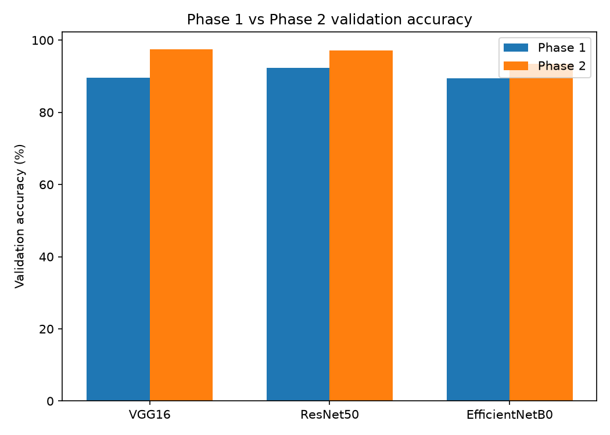
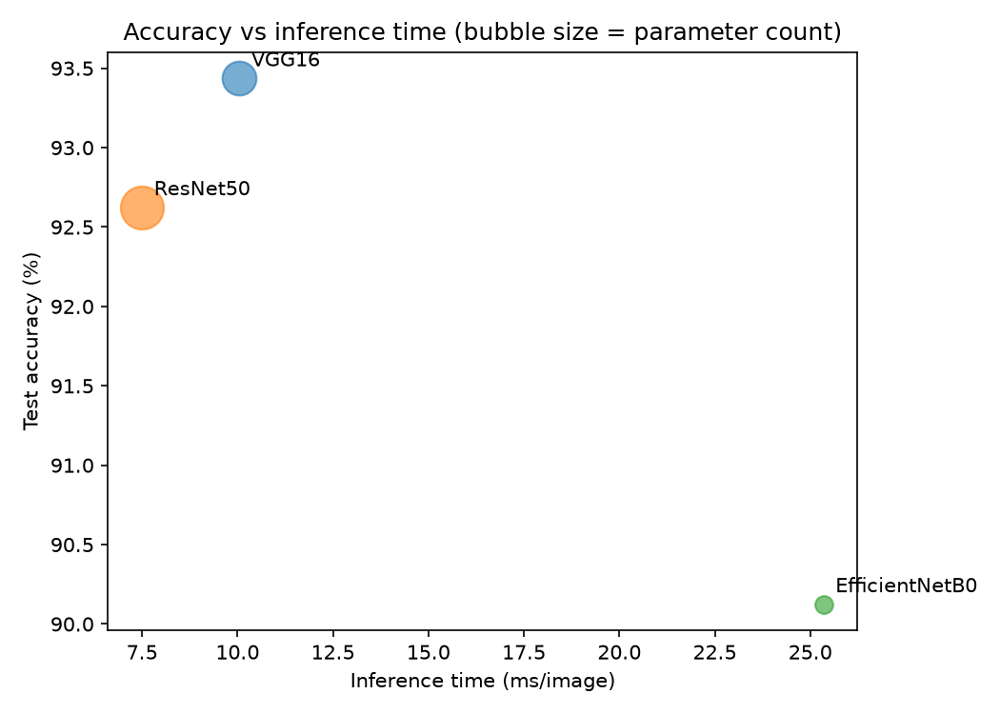
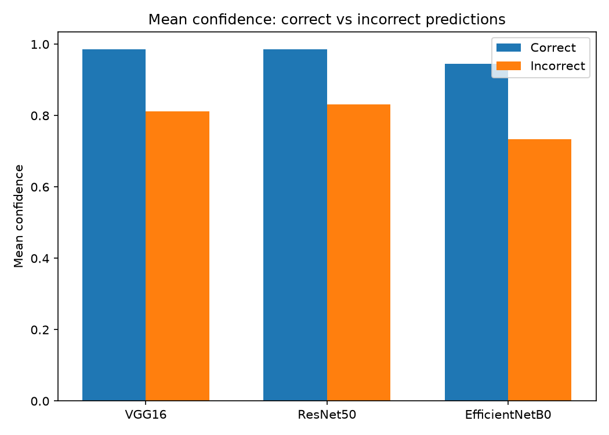
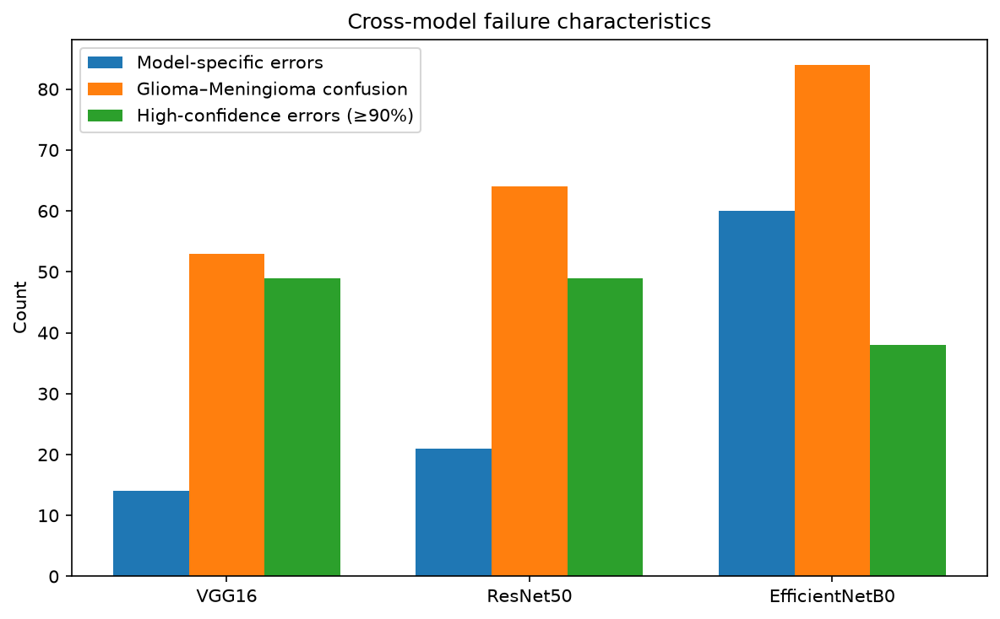
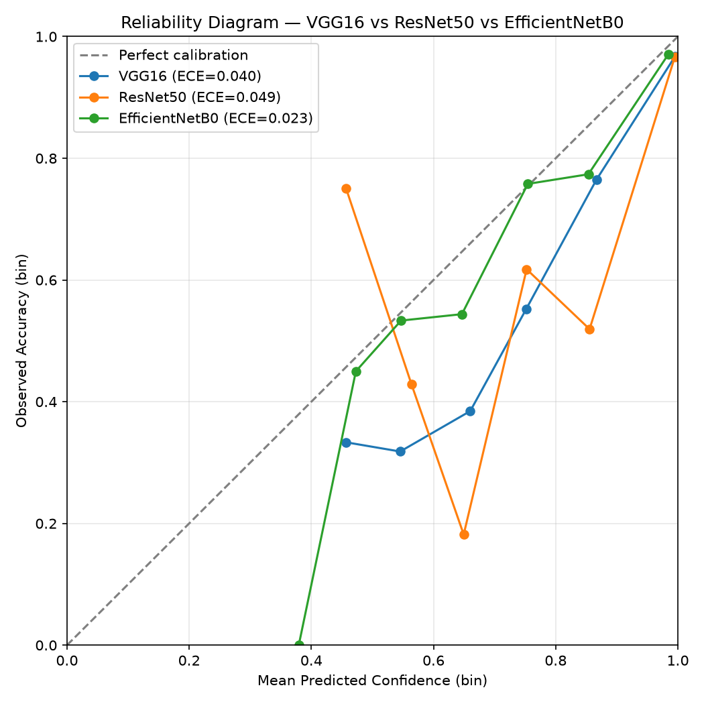

# 🧠 Brain Tumor MRI Classification

### A Controlled Comparative Study of VGG16, ResNet50 & EfficientNetB0

  
  
  
  
  

  <strong>4-class brain-tumor MRI classification</strong> 
  Controlled evaluation across performance, statistical significance, efficiency, calibration, failure behavior, and explainability.

---

## 📑 Table of Contents

- [🔬 Research Question](#-research-question)
- [📌 Study Overview](#-study-overview)
- [📊 Final Results](#-final-results)
- [🧪 Experimental Design](#-experimental-design)
- [🏗️ Models](#️-models)
- [🔁 Two-Phase Training](#-two-phase-training)
- [📐 Statistical Evaluation](#-statistical-evaluation)
- [🔍 Failure Analysis](#-failure-analysis)
- [🎯 Confidence & Calibration](#-confidence--calibration)
- [🧠 Grad-CAM Explainability](#-grad-cam-explainability)
- [📈 Key Findings](#-key-findings)
- [⚠️ Limitations](#️-limitations)
- [📂 Repository Structure](#-repository-structure)
- [🚀 Reproducibility](#-reproducibility)
- [📚 Dataset](#-dataset)
- [📄 Documentation](#-documentation)

---

## 🔬 Research Question

> **How do VGG16, ResNet50, and EfficientNetB0 differ in classification performance, efficiency, confidence/calibration, and failure behavior when evaluated under the same brain-tumor MRI experimental protocol?**

The study deliberately evaluates the models across multiple dimensions rather than ranking them by accuracy alone.

---

## 📌 Study Overview

This project compares three ImageNet-pretrained CNN architectures for classification of brain MRI images into four categories:

| Class | Label |
|---|---:|
| 🟥 Glioma | `0` |
| 🟨 Meningioma | `1` |
| 🟩 No Tumor | `2` |
| 🟦 Pituitary | `3` |

### Evaluation setup

| Setting | Value |
|---|---:|
| Test images | **1,600** |
| Images per class | **400** |
| Input resolution | `224 × 224` |
| Batch size | `64` |
| Random seed | `42` |
| Models | VGG16, ResNet50, EfficientNetB0 |

---

## 📊 Final Results

### Test-set performance

| Model | Accuracy | 95% Bootstrap CI | Parameters | Inference / Image |
|---|---:|---:|---:|---:|
| 🏆 **VGG16** | **93.44%** | 92.19–94.63% | 14.72M | 10.052 ms |
| ResNet50 | 92.63% | 91.31–93.88% | 23.60M | **7.501 ms** |
| EfficientNetB0 | 90.13% | 88.69–91.56% | **4.05M** | 25.348 ms |

> 🏆 **Highest test accuracy:** VGG16 — 93.44%  
> ⚡ **Fastest measured inference:** ResNet50 — 7.501 ms/image  
> 📦 **Smallest parameter count:** EfficientNetB0 — 4.05M

These efficiency measurements are specific to the evaluated software/hardware setup and are not universal architecture-level rankings.

### Statistical significance

| Comparison | Accuracy Difference | Holm-adjusted p | Significant? |
|---|---:|---:|:---:|
| VGG16 vs ResNet50 | +0.81 pp | 0.12373 | ❌ No |
| VGG16 vs EfficientNetB0 | +3.31 pp | 2.56 × 10⁻⁷ | ✅ Yes |
| ResNet50 vs EfficientNetB0 | +2.50 pp | 0.000157 | ✅ Yes |

> The data support a significant advantage for VGG16 and ResNet50 over EfficientNetB0 on this test set. The smaller VGG16–ResNet50 difference is **not statistically significant**.

---

## 🧪 Experimental Design

The study follows a staged evaluation pipeline:

**Training → Controlled Inference → Statistical Testing → Failure Analysis → Calibration → Explainability → Research Synthesis**

### Phase A — Prediction Generation

The three Phase 2 best checkpoints were evaluated on the **same 1,600-image test set**.

For every image-model pair, the pipeline records:

- true class
- predicted class
- class probabilities
- confidence
- prediction correctness
- image identifier / filename
- inference timing

📁 Results: [`results/predictions/`](results/predictions/)

### Phase B — Statistical Rigor

Pairwise model comparisons use:

- McNemar's test
- Holm correction
- 10,000 paired bootstrap iterations
- 95% confidence intervals
- accuracy differences in percentage points

📁 Results: [`results/statistics/`](results/statistics/)

### Phase C — Failure Analysis

Errors are grouped into:

- shared failures
- model-specific failures
- pairwise disagreements
- class-specific errors
- glioma ↔ meningioma confusion
- representative difficult cases

📁 Results: [`results/failures/`](results/failures/)

### Phase D — Model Behavior

The study evaluates:

- Phase 1 → Phase 2 improvement
- parameter count
- trainable parameters
- model size
- inference time
- confidence distributions
- calibration
- high-confidence errors
- Grad-CAM behavior

📁 Consolidated outputs: [`results/analysis/`](results/analysis/)

---

## 🏗️ Models

| Model | Total Parameters | Trainable Parameters | Model Size |
|---|---:|---:|---:|
| **VGG16** | 14.72M | 9.44M | 200.31 MB |
| **ResNet50** | 23.60M | 16.96M | 349.49 MB |
| **EfficientNetB0** | 4.05M | 3.45M | 69.05 MB |

All models use an ImageNet-pretrained convolutional backbone followed by a task-specific classification head.

### Classification head

`GlobalAveragePooling2D → Dropout(0.3) → Dense(4, softmax)`

### Preprocessing

Each model retains its architecture-specific `preprocess_input` operation **inside the saved model**.

| Model | Preprocessing |
|---|---|
| VGG16 | `vgg16.preprocess_input` |
| ResNet50 | `resnet50.preprocess_input` |
| EfficientNetB0 | `efficientnet.preprocess_input` |

Inference therefore uses resized images in the raw **0–255 range** without applying external duplicate preprocessing.

---

## 🔁 Two-Phase Training

### Phase 1 — Frozen Feature Extraction

The pretrained backbone remained frozen while the classification head was optimized.

| Setting | Value |
|---|---|
| Backbone | Frozen |
| Learning rate | `1e-3` |

### Phase 2 — Selective Fine-Tuning

Upper backbone layers were selectively unfrozen for architecture-specific adaptation.

| Model | Phase 1 Val. Acc. | Phase 2 Val. Acc. | Improvement |
|---|---:|---:|---:|
| VGG16 | 89.55% | **97.50%** | **+7.95 pp** |
| ResNet50 | 92.32% | **97.14%** | +4.82 pp |
| EfficientNetB0 | 89.38% | 93.48% | +4.10 pp |

Phase 2 used a learning rate of `1e-5`.

> All three models improved during fine-tuning, with the largest absolute validation gain observed for VGG16.

📊 Visual comparison: [`figures/phase1_vs_phase2_accuracy.png`](figures/phase1_vs_phase2_accuracy.png)

---

## 📐 Statistical Evaluation

Accuracy is evaluated together with paired statistical evidence.

### Methods

- **McNemar's test** for paired correctness differences
- **Holm correction** for the three pairwise comparisons
- **95% paired bootstrap confidence intervals**
- **10,000 bootstrap iterations**
- **α = 0.05**

📄 [`statistical_results.csv`](results/statistics/statistical_results.csv)  
📄 [`statistical_summary.json`](results/statistics/statistical_summary.json)

---

## 🔍 Failure Analysis

The final test predictions were analyzed to determine whether errors were shared or architecture-specific.

### Failure summary

| Model | Total Errors | Shared Errors | Model-Specific Errors |
|---|---:|---:|---:|
| VGG16 | **105** | 72 | **14** |
| ResNet50 | 118 | 72 | 21 |
| EfficientNetB0 | 158 | 72 | **60** |

**72 images** were misclassified by all three models, representing **4.5% of the test set**.

### Major confusion pattern

| Model | Glioma ↔ Meningioma Confusions |
|---|---:|
| VGG16 | **53** |
| ResNet50 | 64 |
| EfficientNetB0 | 84 |

Glioma was also the dominant source of classification errors across the evaluated architectures.

📄 [`failure_cases.csv`](results/failures/failure_cases.csv)  
📄 [`failure_summary_counts.csv`](results/failures/failure_summary_counts.csv)

📊 [`cross_model_failure_distribution.png`](figures/cross_model_failure_distribution.png)

---

## 🎯 Confidence & Calibration

The study evaluates whether model confidence corresponds meaningfully to correctness.

| Model | ECE ↓ | Brier Score ↓ | Mean Confidence | Errors ≥90% Confidence |
|---|---:|---:|---:|---:|
| VGG16 | 0.0400 | **0.1067** | 0.9740 | 49 |
| ResNet50 | 0.0489 | 0.1203 | 0.9736 | 49 |
| EfficientNetB0 | **0.0227** | 0.1528 | 0.9240 | 38 |

### Interpretation

EfficientNetB0 had the lowest ECE, but this did **not** correspond to the strongest classification performance or lowest Brier score.

This demonstrates that:

> **Calibration quality and classification performance are complementary properties.**

All three models also produced incorrect predictions with high confidence, showing that confidence alone is not sufficient evidence of correctness.

📊 [`reliability_diagram.png`](results/calibration/reliability_diagram.png)

📄 [`calibration_summary.csv`](results/calibration/calibration_summary.csv)

📄 [`high_confidence_errors.csv`](results/calibration/high_confidence_errors.csv)

---

## 🧠 Grad-CAM Explainability

Grad-CAM was used as a **post-hoc qualitative explanation method** for selected difficult predictions.

### Target layers

| Model | Grad-CAM Layer |
|---|---|
| VGG16 | `block5_conv3` |
| ResNet50 | `conv5_block3_3_conv` |
| EfficientNetB0 | `top_conv` |

The analysis covers **270 selected failure/model cases** across:

- shared failures
- model-specific failures
- pairwise disagreements
- glioma ↔ meningioma confusion

📁 Grad-CAM outputs: [`results/explainability/gradcam/`](results/explainability/gradcam/)

📄 Grad-CAM metadata: [`gradcam_metadata.csv`](results/failures/gradcam_metadata.csv)

> ⚠️ Grad-CAM is treated as qualitative supporting evidence. It does **not** establish causal reasoning, anatomical correctness, clinical relevance, or deployment safety.

---

## 📈 Key Findings

### 🏆 Performance

VGG16 achieved the highest test accuracy at **93.44%**, although its advantage over ResNet50 was not statistically significant.

### 🔬 Statistical evidence

Both VGG16 and ResNet50 significantly outperformed EfficientNetB0 under the evaluated test protocol.

### 🔧 Fine-tuning

The second training stage improved validation accuracy for all three models, with the largest gain observed for VGG16.

### ⚙️ Efficiency

ResNet50 had the fastest measured inference time, while EfficientNetB0 had the smallest parameter count and model footprint.

### 🎯 Reliability

EfficientNetB0 had the lowest ECE, but its overall classification and Brier performance were weaker. Calibration therefore should not be interpreted independently of accuracy and error behavior.

### 🔍 Failure behavior

All models shared 72 failures. EfficientNetB0 produced substantially more total and model-specific errors and showed the highest number of glioma ↔ meningioma confusions.

### 🧩 Overall conclusion

The evaluated architectures exhibit different trade-offs across **performance, statistical evidence, efficiency, confidence/calibration, and failure behavior**. On this dataset and protocol, no single metric fully characterizes model quality.

---

## ⚠️ Limitations

The current results are limited to:

- one brain-tumor MRI dataset
- a held-out test set of 1,600 images
- the evaluated test distribution
- the specific training and preprocessing pipeline
- the measured hardware/software environment

The study does **not** establish:

- external-dataset generalization
- clinical validity
- diagnostic safety
- regulatory compliance
- deployment readiness

Real-world MRI data may differ in scanner, acquisition protocol, preprocessing, image quality, artifacts, patient population, and class distribution.

📄 See [`docs/limitations.md`](docs/limitations.md) for the complete evidence boundary.

---

## 📂 Repository Structure

    brain-tumor-mri-dl/
    ├── README.md
    ├── requirements.txt
    ├── .gitignore
    │
    ├── notebooks/
    │   └── training/
    │       └── brain_tumor_classification.ipynb
    │
    ├── src/
    │   ├── inference/
    │   │   └── generate_predictions.py
    │   ├── statistics/
    │   │   └── statistical_analysis.py
    │   ├── explainability/
    │   │   └── gradcam_analysis.py
    │   └── analysis/
    │       ├── failure_analysis.py
    │       ├── calibration_analysis.py
    │       ├── model_behavior_analysis.py
    │       └── final_model_comparison.py
    │
    ├── results/
    │   ├── predictions/
    │   ├── statistics/
    │   ├── failures/
    │   ├── calibration/
    │   ├── explainability/
    │   │   └── gradcam/
    │   └── analysis/
    │
    ├── figures/
    │
    ├── docs/
    │   ├── findings.md
    │   ├── methodology.md
    │   ├── limitations.md
    │   └── experiment_log.md
    │
    └── report/
        └── research_report.md

> Large datasets and model checkpoints are intentionally kept outside the Git repository where appropriate.

---

## 🚀 Reproducibility

### 1. Clone

`git clone https://github.com/chair-amrit/brain-tumor-mri-dl.git`

`cd brain-tumor-mri-dl`

### 2. Install dependencies

`pip install -r requirements.txt`

### 3. Prepare the dataset

Download the [Masoud NickParvar Brain Tumor MRI Dataset](https://www.kaggle.com/datasets/masoudnickparvar/brain-tumor-mri-dataset) and follow [`data/README.md`](data/README.md).

### 4. Training

Open the training notebook:

[`notebooks/training/brain_tumor_classification.ipynb`](notebooks/training/brain_tumor_classification.ipynb)

### 5. Analysis pipeline

The repository separates analysis into reproducible stages:

- Prediction generation → [`src/inference/`](src/inference/)
- Statistical evaluation → [`src/statistics/`](src/statistics/)
- Failure analysis → [`src/analysis/failure_analysis.py`](src/analysis/failure_analysis.py)
- Calibration → [`src/analysis/calibration_analysis.py`](src/analysis/calibration_analysis.py)
- Model behavior synthesis → [`src/analysis/model_behavior_analysis.py`](src/analysis/model_behavior_analysis.py)
- Final comparison table → [`src/analysis/final_model_comparison.py`](src/analysis/final_model_comparison.py)
- Grad-CAM → [`src/explainability/gradcam_analysis.py`](src/explainability/gradcam_analysis.py)

---

## 📊 Results & Artifacts

| Artifact | Purpose |
|---|---|
| [`final_model_comparison.csv`](results/analysis/final_model_comparison.csv) | Consolidated model-level evidence |
| [`statistical_results.csv`](results/statistics/statistical_results.csv) | Pairwise statistical comparisons |
| [`failure_cases.csv`](results/failures/failure_cases.csv) | Selected difficult cases |
| [`gradcam_metadata.csv`](results/failures/gradcam_metadata.csv) | Grad-CAM case index |
| [`calibration_summary.csv`](results/calibration/calibration_summary.csv) | ECE, Brier and confidence results |
| [`reliability_diagram.png`](results/calibration/reliability_diagram.png) | Calibration visualization |

### Key Figures

---

## 📚 Dataset

**Brain Tumor MRI Dataset — Masoud NickParvar**

[Kaggle dataset page](https://www.kaggle.com/datasets/masoudnickparvar/brain-tumor-mri-dataset)

The evaluated test set contains:

| Class | Test Images |
|---|---:|
| Glioma | 400 |
| Meningioma | 400 |
| No Tumor | 400 |
| Pituitary | 400 |
| **Total** | **1,600** |

Dataset documentation: [`data/README.md`](data/README.md)

---

## 📄 Documentation

| Document | Description |
|---|---|
| [`docs/findings.md`](docs/findings.md) | Evidence-backed research findings |
| [`docs/methodology.md`](docs/methodology.md) | Experimental methodology |
| [`docs/limitations.md`](docs/limitations.md) | Scope and evidence boundaries |
| [`docs/experiment_log.md`](docs/experiment_log.md) | Experimental workflow and record |
| [`report/research_report.md`](report/research_report.md) | Full research narrative |

---

## 🔮 Future Work

The following are intentionally outside the current core study:

- External-dataset robustness evaluation
- Cross-dataset generalization analysis
- Additional explainability methods
- Segmentation-based analysis
- Multimodal MRI evaluation
- Deployment-oriented experiments

> **Optional robustness experiment:** external-dataset inference can be added after the core study is finalized without changing the existing evaluation results.

---

## 👤 Author

**Amrit Rajkumar**  
B.Tech in Artificial Intelligence & Machine Learning  
Assam Don Bosco University

**Supervisor:** Dr. Nilakshi Devi

---

## 📜 License

This project is developed for academic and research purposes as part of a B.Tech AI/ML project.

---

  <strong>Research scope: controlled comparative evaluation of deep learning models for brain-tumor MRI classification.</strong>

